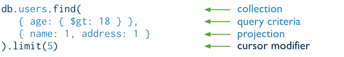

# 2. CRUD

## Create

### Insert Documents
* In MongoDB, the `db.collection.insert()` method adds new documents into a collection
    * db.foo.insert({a: 1});

* Insert multiple documents use `batchInsert`

* Insert validation:
    * Check the document's basic structure and adds an "_id" field if one does not exists
    * Check size: smaller than 16Mb

### Insert an Array of Documents
* Pass an array of documents to the `db.collection.insert()` method to insert multiple documents
* Create an array of documents
```
var mydocs = [{name: 'a'}, {name: 'b'}, {name: 'c'}];
```
* Insert the documents
```
db.person.insert(mydocs);
```

### Insert Multiple Documents with Bulk
* Initialize a Bulk operations builder
```
var bulk = db.person.initializeUnorderedBulkOp();
```
* Add insert operations to the **bulk** object
```
bulk.insert({name: 'foo'});
bulk.insert({name: 'bar'});
```
* Execute the bulk operation
```
bulk.execute();
```

### db.collection.insert()
```
db.collection.insert(
    <document or array of documents>,
    {
        writeConcern: <document>,
        ordered: <boolean>
    }
)
```

* Insert a Document without Specifying an `_id` field
    * *mongod* will create the `_id` field and assign it a unique ObjectId
```
db.products.insert({ item: 'card', qty: 15 })
```

* Insert a Document Specifying an _id field
    * `_id` must be unique within the collection to avoid duplicate key error
```
db.products.insert( { _id: 10, item: 'box', qty: 20 })
```

* Insert Multiple Documents
    * By default, MongoDB performs an *ordered* insert (i.e if an error occurs during an insert of one of the documents, MongoDB returns on error without processing the remaining documents in the array)
```
db.products.insert(
    [
        { _id: 11, item: 'pencil', qty: 50, type: 'no.2' },
        { item: 'pen', qty: 20  },
        { item: 'eraser', qty: 24, type },
    ]
)
```

* Perform an Unordered Insert
    * With *unordered* insert, if an error occurs during an insert of one of the documents, MongoDB continues to insert the remaining documents in the array
```
db.products.insert(
    [
        { _id: 20, item: 'lamp', qty: 50, type: 'desk' },
        { _id: 20, item: 'lamp', qty: 20, type: 'floor' },
        { _id: 22, item: 'bulk', qty: 100 }
    ],
    { ordered: false }
)    
```

* Override Default Write Concern
```
db.products.insert(
    { item: 'envelopes', qty: 100, type: 'claps' },
    { writeConcern: { w: 'majority', wtimeout: 5000 } }
)
```

### db.collection.save()
* Updates an existing document or inserts a new document, depending on its **document** parameter
```
db.collection.save(
    <document,
    {
        writeConcern: <document>
    }
)
```

* Behavior
    * Safe Writes
    * Insert - if the document does *not* contain an `_id` field, then the *save()* method calls the *insert()* method
    * Update - if the document contains an `_id` field, then the *save()* method is equivalent to an update with the upsert option set to **true** and the query predicate on the `_id` field

* Save a New Document without Specifying an `_id` Field
```
db.products.save( { item: 'book', qty: 40 } )
```

* Save a New Document Specifying an `_id` field
```
db.products.save( { _id: 100, item: 'water', qty: 30 } )
```

* Replace an Existing Document
    * The **products** collection contains the document `{ _id: 100, item: 'water', qty: 30 }`
    * The **save()** method perform an update with **upsert:true** since the document contains an `_id` field    
```
db.products.save( { _id: 100, item: 'juice' } )
```

* Override Default Write Concern
```
db.products.save(
    { item: "envelopes", qty : 100, type: "Clasp" },
    { writeConcern: { w: "majority", wtimeout: 5000 } }
)
```

## Read    

### Read Operations Overview
* Read operations, or *queries*, retrieve data stored in the database
* In MongoDB, queries select *documents* from a single *collection*

### Query Interface
* *db.collection.find()*
* The method accepts both the query criteria and projections and returns a *cursor* to the matching documents



### Query Behavior
* All queries in MongoDB address a *single* collection
* You can modify the query to impose *limits*, *skips* and *sort orders*
* The order of the documents returned by a query is not defined unless you specify a *sort()*
* Operations that modify existing documents (i.e *updates*) use the same query syntax as queries to select documents to update
* In *aggregation* pipeline, the *$match* pipeline stage provides access to MongoDB queries

### Query Statements


### Projections
* Queries in MongoDB return all fields in all matching documents by default
* To limit the amount of data that MongoDB *sends* to applications, include a *projection* in the queries
* Be projecting results with a subset of fields, applications reduce their network overhead and processing requirements
* Projections, which are the *second* argument to the *find()* method, may either specify a list of fields to return or list fields to exclude in the result documents


### Projection Behavior
* Be default, the `_id` field is included in the results. To suppress the `_id` field from the result set, specify `_id: 0` in the projection document
* For fields that contain arrays, MongoDB provides the following projection operators: $elemMatch, $slice, and $
* For related projection functionality in the aggregation framework pipeline, use the $project pipeline stage

## Cursors
* In the mongo shell, the *db.collection.find()* method queries a collection and returns a *cursor* to the returning documents
* To access the document, you need to iterate the cursor

### Cursor Behaviors
* **Closure on Inactive Cursors**
    * Be default, the server will automatically close the cursor after 10 minutes of inactivity or if client has exhausted the cursor
    * To override this behavior, you can specify the **noTimeOut** flag in your query using *cursor.addOption*
    * However, you should either close the cursor manually or exhaust the cursor
```
var myCursor = db.inventory.find().addOption(DBQuery.Option.noTimeout);
```

* **Cursor Isolation**
    * The cursor is not isolated during its lifetime, intervening write operations on a document may result in a cursor that returns a document more than once if that document has changed
    * To handle this situation, use *snapshot mode*
    
* **Cursor Batches**
    * MongoDB server returns the query returns in batches
    * Batch size will not exceed the maximum BSON document size
    * For most queries, the *first* batch returns 101 documents or just enough document to exceed 1 megabyte
    * Subsequent batch size is 4 megabytes
    * To override the default size of the batch, see *batchSize()* and *limit()*
    
### Cursor Information
* db.serverStatus() method returns a document that includes a metrics field
* The metrics field contain a cursor field with the following information:
    * number of timed out cursors since the last server restart
    * number of open cursors with the option *DBQuery.Option.noTimeout* set to prevent timeout
    * number of "pinned" open cursors
    * total number of open cursors

### db.collection.find()
* `db.collection.find()` method retrieves documents from a collection
* `db.collection.find()` returns a *cursor* to the retrieved documents

* Select All Documents in a Collection
    * An empty query document ({}) select all documents in the collection
    ```
    db.inventory.find( {} )
    ```
    * Not specifying a query document to the *find()* method is equivalent to specifying an empty query document
    ```
    db.inventory.find()
    ```

* Specify Equality Condition
    * Use query document `{ <field>: <value> }` to select all documents that contain the <field> with the specified <value>
    ```
    db.inventory.find( { type: 'snack' })
    ```

* Specify Conditions Using Query Operators    
```
db.inventory.find( { type: { $in: [ 'food', 'snack' ] } } );
```

* Specify AND Conditions
```
db.inventory.find( { type: 'food', price: { $lt: 9 } } );
```

* Specify OR Conditions
```
db.inventory.find(
    {
        $or: [ { qty: { $gt: 100 } }, { price: { $lt: 9 } } ]
    }
)    
```

* Specify AND as well as OR Conditions
```
db.inventory.find(
    {
        type: 'food',
        $or: [ { qty: { $gt: 100 } }, { price: { $lt: 9 } } ]
    }
)
```

* Exact Match on the Embedded Document
    * To specify an equality match on the whole embedded document, use the query document `{ <field>: <value> }` where <value> is the document to match
    * Equality matches on an embedded document require an *exact* match of the specified <value>, including the field order
    * The query match all document where the value of the field **producer** is an embedded document that contain *only* the field company and address
    ```
    db.inventory.find(
        {
            producer:
                {
                    company: 'ABC',
                    address: '123 Street'
                }
        }
    )
    ```

* Equality Match on Fields within an Embedded Document
    * Use the *dot notation* to match by specify fields in an embedded document, the embedded document may contain other fields
    ```
    db.inventory.find( { 'producer.company': 'ABC123' } )
    ```

* Exact Match on an Array
    * Queries for all documents where the field *ratings* is an array that holds exactly three elements 5, 8, 9
    ```
    db.inventory.find( { ratings: [ 5, 8, 9 ] } )
    ```

* Match an Array Element
    * Find all documents where **ratings** is an array that contains 5 as one of its elements
    ```
    db.inventory.find( { ratings: 5 } )
    ```

* Match a Specific Element of an Array
    * Match all documents where **ratings** array contains 5 as the first element
    ```
    db.inventory.find( { 'ratings.0': 5 } )
    ```
* Single Element Satisfies the Criteria
    * Queries for documents where the **ratings** array contains at least one element that is grater than 5 and less than 9
    ```
    db.inventory.find( { ratings: { $elemMatch: { $gt: 5, $lt: 9 } } } )
    ```
* Combination of Elements Satisfies the Criteria    
    * Queries for documents where the **ratings** array contains elements that in some combination satisfy the query condition
    ```
    db.inventory.find( { ratings: { $gt: 5, $lt: 9 } } )
    ```

* Match a Field in the Embedded Document Using the Array Index
    * Selects all documents where the **memos** contains an array whose first element is a document that contains the field **by** whose value is 'shipping'
    ```
    db.inventory.find( { 'memos.0.by': 'shipping' } )
    ```
    
* Match a Field Without Specifying Array Index
    * Selects all documents where the **memos** field contains an array that contains at least one embedded document that contains the field **by** with the value 'shipping'
    ```
    db.inventory.find( { 'memos.by': 'shipping' } )
    ```
* Specify Multiple Criteria for Array of Documents
    * Single Element Satisfies the Criteria: query for documents where the **memos** arrays has at least one embedded document that contains both the field **memo** equal to 'on time' and the field **by** equal to 'shipping'
    ```
    db.inventory.find(
        {
            memos:
            {
                $elemMatch:
                    {
                        memo: 'on time',
                        by: 'shipping'
                     }
            }
        }
    )    
    ```
    * Combination of Elements Satisfies the Criteria: query for documents where **memos** array contains elements that in some combination satisfy the query conditions
    ```
    db.inventory.find(
        {
            'memos.memo': 'on time',
            'memos.by': 'shipping'
        }
    )
    ```
    
## Update
* `db.collection.update` to update the documents of a collection
* `update` method accepts 3 parameters:
    * an update conditions document to match the document to update
    * an update operations documents to specify the modification to perform
    * an option document
* By default, updates a single document

* Use update operators to change field values: $set will create the field if the field does not exist, $currentDate operator update the field with the current date value
```
db.inventory.update(
    { item: 'MNO2' },
    {
        $set: {
            category: 'apparel',
            detail: { model: '14Q3', manufacturer: 'XYZ Company' }
        },
        $currentDate: { lastModified: true }
    }
)
```

* Update an embedded field: update the model **field** within the embedded **details** document
```
db.inventory.update(
    { item: 'ABC1' },
    { $set: { 'details.model': '14Q2' } }
)
```

* Update multiple documents
```
db.inventory.update(
    { category: 'clothing' },
    {
        $set: { category: 'apparel' },
        $currentDate: { lastModified: true }
    },
    { multi: true }
)
```

* Replace the Document: pass an entire new document as the second argument to `update()`
```
db.inventory.update(
    { item: 'BE10' },
    {
        item: 'BE05',
        stock: [ { size: 'S', qty: 20 }, { size: 'M', qty: 5 } ],
        category: 'apparel'
    }
)
```

* upset Option: by default, if no document matches the update query, the `update()` method does nothing. However, by specifying `upsert: true`, the `update()` method either updates matching document or documents, or inserts a new document if no matching document exists
```
db.inventory.update(
    { item: 'TBD1' },
    {
        item: 'TBD1',
        details: { 'model': '14Q4' }
    },
    { upsert: true }
)
```
 
## Delete    
* `db.collection.remove()` method removes documents from a collection
* You can remove all documents from a collection, remove all documents that match a condition, or limit the operation to remove just a single document
* `remove()` method does not remove indexes
```
db.collection.remove(
    <query>: <document>,
    <justOne>: <boolean> (default: false)
)
```
Or
```
db.collection.remove(
    <query>: <document>,
    {
        justOne: <boolean> (default: false),
        writeConcern: <document>
    }
)
```

* Remove All Documents: pass an empty query document `{}` to the `remove()` method. 
```
db.inventory.remove({})
```

* Remove Documents that Match a Condition: call with <query> parameter, the following example removes all document where the **type** field is food
```
db.inventory.remove( { type: 'food' } )
```

* Remove a Single Document that Matches a Condition: set **justOne** to **true** or **1**
```
db.inventory.remove( { type: 'food' }, 1)
```

* *db.collection.findAndModify(document)*: modifies and returns a single document
```
db.collection.findAndModify({
    query: <document>,
    sort: <document>,
    remove: <boolean>,
    update: <document>,
    new: <boolean>,
    fields: <document>,
    upsert: <boolean>
});
```

* Update and Return
```
db.people.findAndModify({
    query: { name: 'Tom', state: 'Active', rating: { $gt: 10 } },
    sort: { rating: 1 },
    update: { $inc: { score: 1 } }
});
```

* Upsert
```
db.people.findAndModify({
    query: { name: 'Gus', state: 'active', rating: 100 },
    sort: { rating: 1 },
    update: { $inc: { score: 1 } },
    upsert: true
});
```

* Return New Document
```
db.people.findAndModify({
    query: { name: 'Pascal', state: 'active', rating: 25 },
    sort: { rating: 1 },
    update: { $inc: { score: 1 } },
    upsert: true,
    new: true
});
```

* Sort and Remove: 
```javascript
db.people.findAndModify({
    query: { state: 'active' },
    sort: { rating: 1 },
    remove: true
});
```