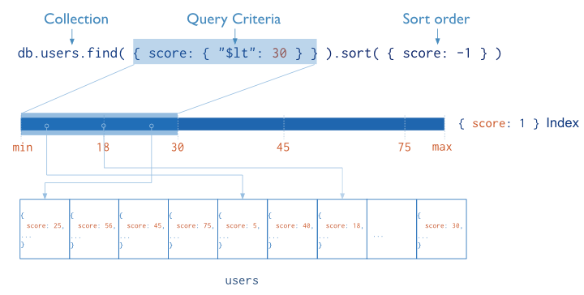
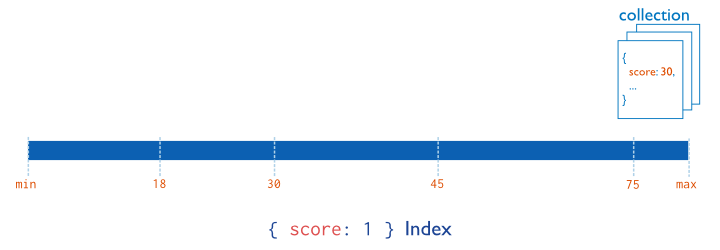
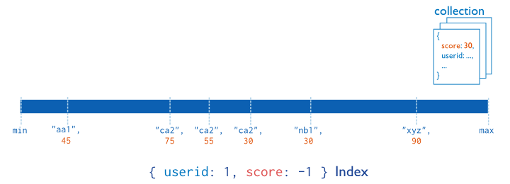
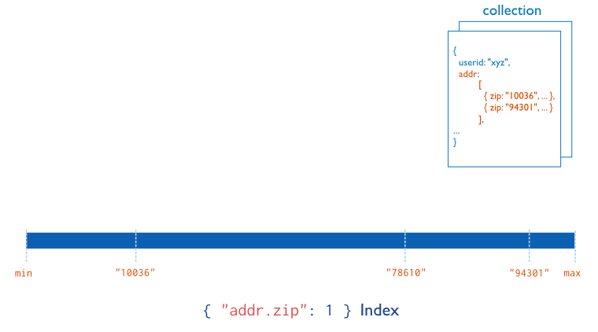

# 4. Indexing and Performance
* Support efficient execution of queries in MongoDB, limit the number of inspect documents
* Without indexes, MongoDB must perform a *collection scan*
* Index stores the value of a specific fields or set of fields, ordered by the value of the field
* The ordering supports efficient equality matches and range-based query operations
* Can return sorted results by using the ordering



## 4.1 Single Key Indexes
* Support for indexes on any field in a collection of documents
* By default, all collections have an index on the `_id` field

;

* Example
```
{ "_id" : ObjectId(...),
  "name" : "Alice",
  "age" : 27
}
```

* Create an index on field **name**
```
db.friends.createIndex( { "name" : 1 } )
```

* Indexes on Embedded Fields
```
{"_id": ObjectId(...),
 "name": "John Doe",
 "address": {
        "street": "Main",
        "zipcode": "53511",
        "state": "WI"
        }
}
```

* Create an index on **address.zipcode** field
```
db.people.createIndex( { "address.zipcode": 1 } )
```

* Indexes on Embedded Documents
```
{
  _id: ObjectId(...),
  metro: {
           city: "New York",
           state: "NY"
         },
  name: "Giant Factory"
}
```

* Creates an index on the **metro** field
```
db.factories.createIndex( { metro: 1 } )
```

## 4.2 Compound Indexes
* Single index structure holds references to multiple fields within a collection's documents



* The order of the fields in a compound index is very important
* Sort order can matter in determining whether the index can support a sort operation

* Sor that do *not* use index will abort after use 32 megabytes of memory
* Sort keys must be listed in the *same order* as they appear in the index
* Sort must specify the *same sort direction* for all its keys as the index key pattern or specify the *reverse sort direction* for all its keys as the index key pattern
* Index key `{ a: 1, b: 1 }` support sort on `{ a: 1, b: 1 }` and `{ a: -1, b: -1 }` but not on `{ a: -1, b: 1 }`
* To sort on a non-prefix subset of the index key, the query must include **equality** conditions on all the prefix keys that precede the sort keys
* Example, the collection **data** has the index:
```
{ a: 1, b: 1, c: 1 }
```
* The following operations can use the index to get the sort order:
```
db.data.find({ a: 5 }).sort({ b: 1, c: 1 })
db.data.find({ b: 3, a: 4 }).sort({ c: 1 })
db.data.find({ a: 3, b: { $lt: 3 } }).sort({ b: 1 })
```

* Index prefixes are the *beginning* subsets of indexed fields

## 4.3 Multi-key Indexes
* Index a field that hold an array value



* MongoDB automatically creates a multikey index if any indexed field is an array

* For a compound multikey index, each indexed document can have at *most* one indexed field whose value is an array

* **cannot** specify a multikey index as the shard key index

* Hashed indexes **cannot** be multi

* A multikey index cannot support a covered query
* Array elements
* One index for each element in array

## 4.4 Mechanics
* Creating an index blocks all other operations on a database
* When building an index on a collection, the database that holds the collection is unavailable
* `{ background: true }` indexing in background so other database operations can run
* Need to open another connection or mongo instance

* Index is building in background, you cannot perform other administrative operations involving that collection (including repairDatabase, dropping the collection, and running compact)

* Index grow?
* Go wrong?

## 4.5 Performance
* Check for indexes at start up using the *getIndexes()* method
* Always build indexes in production instances using separate application code, during maintenance windows

* Default name for an index is the concatenation of the indexed keys an each key's direction in the index
* Or specify the name of index using `{ name: 'value' }`

// TODO
* Limit? in memory sort

## 4.6 Storage engines
// TODO
* MMAPv1 vs WireTiger
* Document movement