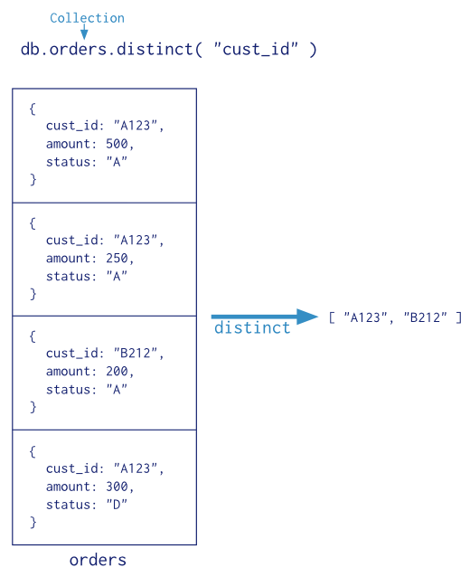

# 5. Aggregation
* Operations that process data records and return computed results

```
db.collection.aggregate(pipeline:<array>, options:<document>)
```
* pipeline: array, sequence of data aggregation operations or stages

## 5.1 Pipeline
* Based on the concept of data processing pipelines
* Documents enter a multi-stage pipeline that transforms the documents into an aggregated result
* Most basic pipeline stages provide
    * *filters* operate like queries
    * *document transformations* modify the form of the output document
* Other pipeline operations provide tools for grouping and sorting


* Map-Reduce
    * *map* stage that processes each document and *emits* one or more objects for each input document
    * *reduce* phase that combines the output of the map operation
* Great flexibility but less efficient and more complex


* Single Purpose Aggregation Operations



## 5.2 Operators
* Pipeline stages appear in an array. Document pass through the stages in sequence
```
db.collection.aggregate([ { <stage>, }, ... ])
```

* $project: reshapes each document in the stream
* $match: filters the document stream
* $redact: reshapes each document in the stream by restricting the content for each document
* $limit: passes the first *n* documents unmodified to the pipeline where *n* is the specified limit
* $skip: skips the first *n* documents where *n* is the specified skip number and passes the remaining documents unmodified to the pipelines
* $unwind: deconstructs an array field from the input to output for *each* element
* $group: groups input documents by a specified identifier expression and applies the accumulator expression(s), if specified, to each group
* $sort: reorders the document stream by a specified sort key
* $geoNear: returns an ordered stream of documents based on the proximity to a geospatial point
* $out: writes the resulting documents to a collection

* Expression Operators
* To construct expressions for use in the aggregation pipeline
* Similar to functions that take arguments
```
{ <operator>: [ <argument1>, <argument2> ... ] }
```
* If operator accepts a single argument, you can omit the outer array
```
{ <operator>: <argument> }
```

## 5.3 Memory usage
* Limit of 100 megabytes of RAM
* Use `allowDiskUse` for handling of large datasets

## 5.4 Behavior specific to sort, skip, limit
* $sort + $limit Memory Optimization
    * When a **$sort** immediately precedes a **$limit** in the pipeline, the **$sort$$ only maintain the top **n** results as it progresses