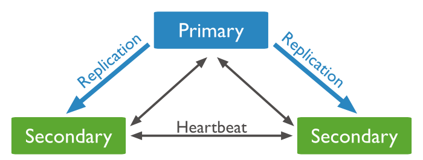
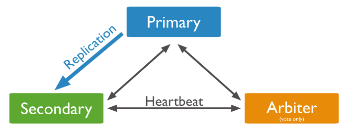
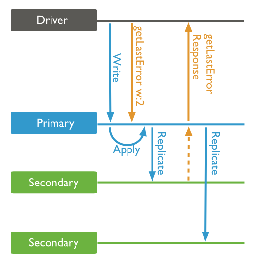
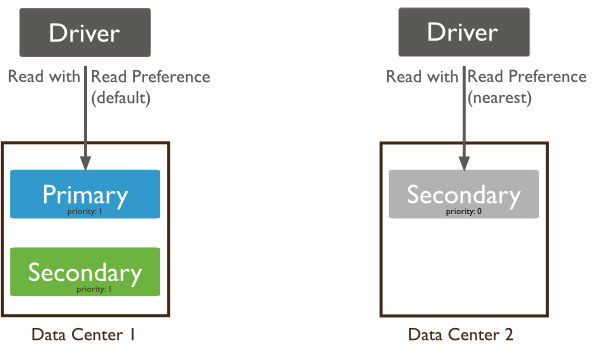
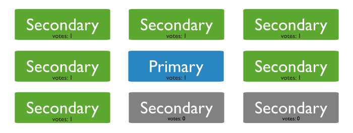
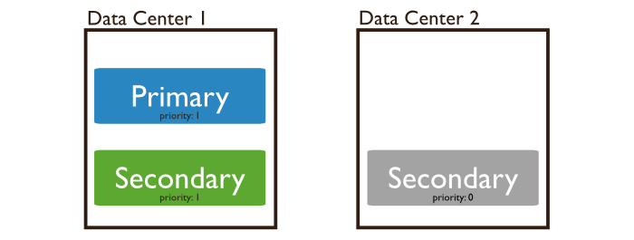

# 6. Replication
* Process of synchronizing data across multiple servers

* Purpose
    * Provides redundancy and increases data availability
    * Protects a database from the loss of a single server
    * Recover from hardware failure and service interruptions
    * Increase read capacity
    * Maintain copies in different data centers to increase locality and availability of data for distributed applications

* Replication in MongoDB
* Group of *mongod* instances that host the same data set
* Primary receives all write operations
* All other instances, secondaries, apply operations from the primary so that they have same data set


* Primary records all changes to its data sets in its **oplog**
* The secondaries replicate the primary's oplog and apply the operations to their data sets



* Arbiter: maintain a quorum in a replica set by responding to heartbeat and election requests. Do not store data set



* Automatic Failover: when a primary does not communicate with other members of the set for more than 10 seconds


## 6.1 Configuration
* Get the configuration of a replica set using `rs.conf()` method or `replSetGetConfig` command
* Example Output
```
{
  _id: <string>, (name of the replica set, must be identical to replication.replSetName or the value of -replSet)
  version: <int>,
  members: [
    {
      _id: <int>, (numeric identifier of every member in the replica set)
      host: <string>, (hostname:portnumber)
      arbiterOnly: <boolean>,
      buildIndexes: <boolean>,
      hidden: <boolean>,
      priority: <number>, (eligibility of a member to become a primary)
      tags: <document>,
      slaveDelay: <int>, (number of seconds "behind" the primary that this member should "lag")
      votes: <number> (number of votes a member will cas in a replica set election)
    },
    ...
  ],
  settings: { (configuration options that apply to the whole replica set)
    getLastErrorDefaults : <document>, (specify the write concern for the replica set)
    chainingAllowed : <boolean>, (allows secondary members to replicate from other secondary members)
    getLastErrorModes : <document>, (define an extended write concern through the use of tags)
    heartbeatTimeoutSecs: <int> (number of seconds that the replica set members wait for a successful heartbeat from each other)
  }
}
```

* To modify the configuration, use `rs.reconfig()` method, passing a configuration document

## 6.2 Oplog Concepts
* oplog (operation log) special *capped collection* that keeps a rolling record of all operations that modify the data store
* MongoDB applies data operations on the primary and then records the operations on the primary's oplog
* The secondary members then copy and apply these operations in an asynchronous process
* All replica set members contain a copy of the oplog

* All replica set members send heartbeats (pings) to all other members
* Any member can import oplog entries from any other member

* The size of oplog
    * For 64-bit Linux, Solaris, FreeBSD, and Windows systems, MongoDB allocates 5% of the available
    * For 64-bit OS X, MongoDB allocates 183 megabytes
    * For 32-bit systems, MongoDB allocates about 48 megabytes
    
* The following workloads might require a larger oplog size
    * Updates to Multiple Documents at Once
    * Deletions Equal the Same Amount of Data as Inserts
    * Significant Number of In-Place Updates
 
* To view oplog status `rs.printReplicationInfo()`

## 6.3 Write Concern
* Confirms the success of write operations to a replica set's primary

* Default write concern confirms write operations only on the primary
* The **w** option confirms that write operations have replicated to the specified number of replica set members



* Modify Default Write Concern
```
cfg = rs.conf()
cfg.settings = {}
cfg.settings.getLastErrorDefaults = { w: 'majority' }
rs.reconfig(cfg)
```

* Use of insufficient write concern can lead to rollbacks in the case of replica set failover

* Custom Write Concerns
    * Use replica set tags to create custom write concern using `getLastErrorDefaults` and `getLastErrorModes`
* Consider a five member replica set, where each member has one of the following tag sets
```
{ "use": "reporting" }
{ "use": "backup" }
{ "use": "application" }
{ "use": "application" }
{ "use": "application" }
```
* Create the mode with the following sequence
```
cfg = rs.conf()
cfg.settings = { getLastErrorModes: { use2: { 'use': 2 } } }
rs.reconfig(cfg)
```
* To use this mode
```
db.runCommand( { getLastError: 1, w: 'use2' } )
```


## 6.4 Read Preference
* Describes how MongoDB clients rout read operations to the members of a replica set



* By default, an application directs its read operations to the *primary* member in a replica set
* Reading from the primary returns the latest version of a document

* You can improve read throughput or reduce latency by distributing some or all reads to secondary members

* Read Preference Modes
    * primary
    * primaryPreferred
    * secondary
    * secondaryPreferred
    * nearest

* Tag Sets: allow to target read operations to specific members of a replica set

* Member Selection

## 6.5 Elections
* Determine which set member will become primary
* Occur after initiating a replica set, and also any time the primary becomes unavailable


* While an election is in process or a majority of the replica set is inaccessible or unavailable, the replica set has no primary and cannot accept writes and all remaining members become read-only

* Election Triggering Events
    * initiation of a new replica set
    * secondary loses contact with primary
    * primary steps down
    
* Primary will step down
    * after receiving *replSetSetDown* command
    * one of the current secondaries eligible *and* has higher priority
    * primary cannot contact a majority of the members of the replica set

* Participation in Election
    * Every member has a *priority* that helps determine its eligibility to become a *primary*
    * Elects an eligible member with the highest *priority* value as primary
    * Be default, all members have a priority of **1**
    
* Vetoes in Elections
    * If the member seeking an election is not a member of the voter's set
    * If the member seeking an election is not up-to-date with the most recent operation
    * If the member seeking an election has lower priority than another member in the set
    * If a priority 0 member is the most current member at the time of the election
    * If the current primary has more recent operations, from perspective of the voting member
    * If the current primary has same or more recent operations
    
* Non-Voting Members    
    * Hold copies of the replica set's data and can accept read operations
    * Do not vote in elections, but **can** veto an election and become primary



## 6.6 Failover
* Process that allows a secondary member to become primary in the event of failure
* Provide high availability using automatic failover

* Rollbacks During Replica Set Failover
* Reverts write operations on a former primary when the member rejoins its replica set after a failover
* Only if the primary had accepted write operations that the secondaries had **not** successfully replicated before the primary stepped down

* A rollback does *not* occur if the write operations replicate to another member before the primary steps down *and* that member remains available and accessible to a majority of the set

* MongoDB write the rollback data to BSON files in the **rollback/** folder under the data's *dbPath* directory
```
<database>.<collection>.<timestamp>.bson
```

* Avoid Replica Set Rollbacks
    * Use `{ w: 'majority' }` write concern to guarantee that the write operations propagate to a majority of the replica set
* Note:
    * Regardless of *write concern*, other clients can see the result of write operations before the write operation is acknowledged to the issuing client
    * Clients can read data which may be subsequently rolled back
 
* Rollback Limitations
    * Not rollback more than 300 megabytes

## 6.7 Deployment to Multiple Data Centers
* Adding members to a replica set in multiple data centers add redundancy and provides fault tolerance if one data center is unavailable

* Example: architecture of f geographically distributed replica set
    * One primary in the main data center
    * One secondary in the main data center
    * One priority 0 member in a second data center

