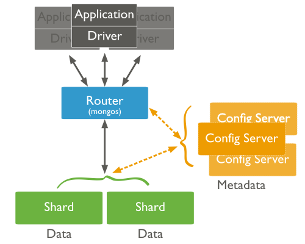
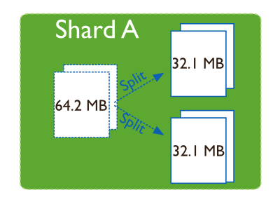
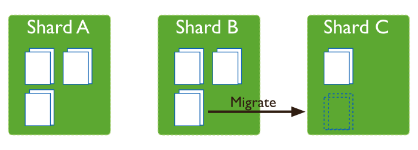
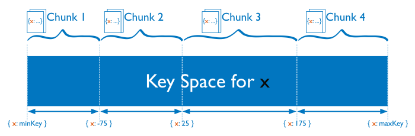

# 7. Sharding
* Method for storing data across multiple machines
* Support deployment with very large data sets and high throughput operations

* **Vertical scaling**  add more CPU and storage resources to increase capacity
* **Sharding** or *horizontal scaling*, divides the data set and distributes the data over multiple servers, or **shards**

* Reduces the number of operations each shard handles
* Reduces the amount of data that each server needs to store

* MongoDB supports sharding through the configuration of a sharded clusters

## 7.1 Components

* Shards: *replica set* or a single *mongod* that contains a subset of the data for the shared cluster
* Query Routes: or *mongos* instances, interface with client applications and direct operations to the appropriate shards
* Config servers: special *mongod* instances that store the metadata for the sharded cluster

## 7.2 When to Shard
* When you have to
* No longer able to vertical scaling

## 7.3 Balancing
* Process uses to distribute data of a shared collection evenly across a shared clustered
* When a shard has too many of a sharded collection's chunks compared to other shards, MongoDB automatically balances the chunks across the shards

* Concept of chunks: smaller, non-overlapping ranges, where a chunk is a range of values from some minimum value to some maximum value

* Splitting: background process that keeps chunks from growing too large

* Balancing: background process manages chunk migrations. When the distribution is uneven, the balancer process migrates chunks from the shard that hast largest number of chunks to the shard with least number of chunks

## 7.4 Shard keys
* Determines the distribution of the collection's documents among the cluster's shards
* Shard key is either an indexed field or an indexed compound field that exists in every document

* MongoDB partitions data in the collection using ranges of shard key values
* Each range, or *chunk*, define a non-overlapping range of shard key values

## 7.5 Hashed shard keys
* Use a *hashed index* of a single field as the shard key to partition data

Chunk Migration
https://docs.mongodb.org/manual/core/sharding-chunk-migration/